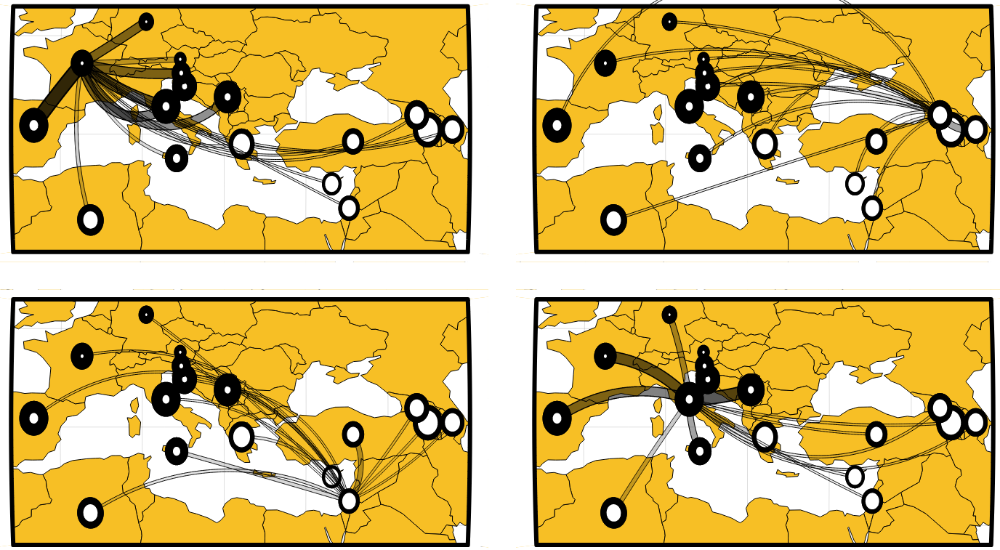

# ReMIXTURE

ReMIXTURE is an intuitive way to show how genetic diversity in a population is distributed and overlapped between regions of the globe.



- Outer Circle=Total diversity
- Inner Circle=Region-unique diversity
- Line width=Overlapped diversity

ReMIXTURE is an R package, and to run it requires:

1) A symmetrical numeric matrix of pairwise sample-to-sample distances (any distance metric will do in principle), whose rownames and colnames give the region to which the sample is assigned.
2) A data.table or data.frame with column names `region`, `lon`, and `lat`, providing the position (numeric) on the globe given to each region (character).

# Demo pipeline and basic method description

A more comprehensive pipeline, exploring most of the package functionality, is provided in the examples section of `?ReMIXTURE`

Sample data sets are provided. To run a very simple analysis, start with the following pipeline:

## Install/load

```
#devtools::install_github("https://github.com/mtrw/ReMIXTURE") #if needed
library(ReMIXTURE)
```

## Initialise analysis with demo data from Tripodi & Rabanus-Wallace et al. 2021

```
my_analysis <- ReMIXTURE$new(
  distance_matrix = ReMIXTURE::ReMIXTURE_example_distance_matrix,
  region_table = ReMIXTURE::ReMIXTURE_example_region_positions
)
```

## Plot distance densities and and MDS plot, just good tools for data exploration and selecting H-cutoff options (see later)

```
my_analysis$plot_distance_densities(set_xlims = c(0,0.15)) # Makes multiple plots
my_analysis$plot_MDS()
```

These will be important for choosing parameters to try in the next step ...

## Run

This will:

- Subsample some equal number of individuals from each group, that number being some user-defined proportion of the smallest group size.
- Heirarchically cluster them (see ?ReMIXTURE section $run for a description of how the H-cutoffs for clustering are chosen)
  - The total diversity of a region is the number of clusters it appears in.
  - The total unique diversity of a region is the clusters it _and only it_ appears in.
  - The diversity overlapped between two regions is the number of clusters they both appear in.
- This is repeated a user-defined number of times to yield a mean and variance on the three measures above.

We normally run for a selection of different parameters, the results of all will be saved, and we can use some diagnostic plots later to choose which were suitable for plotting.

```
my_analysis$run()
```

## Plot maps

```
#list regions
my_analysis$region_table

my_analysis$plot_maps(
  focalRegion = "Asia South and South East", # omit to print all. Useful in conjuction with `par(mfrow=c(<nRows>,<nCols>))`
  run = 3,
  #range_lon = c(-23.0,60.0), # to play with map range, omit for the full globe
  #range_lat = c(20,60),      # to play with map range, omit for the full globe
  width_lims = c(5,20), # size of the circles (smallest and largest) in lat/lon units
  alpha_lims = c(.05,1) # range of alpha values of the region-connecting lines. The alpha just scales along with line thickness (i.e. overlapped diversity) to help visual discrimination when the differences are small.
  #projection = c(equirectangular, winkelIII, eckertIV) # choose a map projection. Or write your own--a function recieving and returning a data.table with numeric columns `lon` and `lat`.
  #curvature_matrix = matrix(abs(rnorm(nrow(my_analysis$region_table)**2))/2,nrow=nrow(my_analysis$region_table),dimnames = list(my_analysis$region_table$region,my_analysis$region_table$region)) # curve the lines to prevent them overlapping. This curves them randomly but you can give it whatever matrix you wish. Currently in radians (will be degrees in future), with -vs and +ve values curving left/right.
)
```

# History

The ReMIXTURE concept was first attempted in Rabanus-Wallace & Tripodi et al. (2021) _Global range expansion history of pepper (_Capsicum spp._) revealed by over 10,000 genebank accessions_. PNAS (please use sci-hub if possible). Newer versions have very significant improvements. The algorithm currently in use is not published.

# Future

ReMIXTURE is under active development, with many features in the works, and a release publication planned.

# Use ReMIXTURE

Any questions, please email me! tim.rabanuswallace@unimelb.edu.au.
