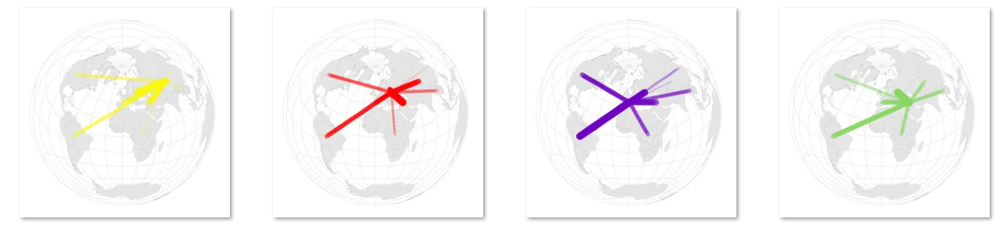
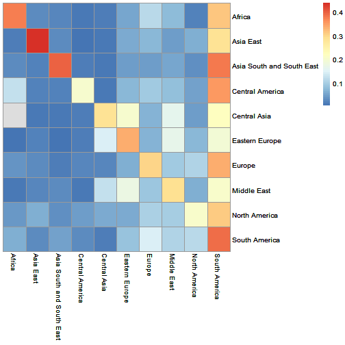
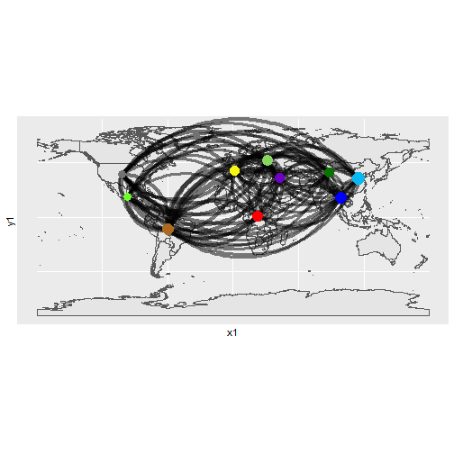

ReMIXTURE
========================================================
author: Frederik Bak, Pavlo Hrab, & Tim Rabanus-Wallace
date: "23/06/21"
autosize: true
font-family: 'Garamond'

Background: How do chilli peppers reflect history?
========================================================


Background: How do chilli peppers reflect history?
========================================================
incremental: true
- The peppers people eat are reflected by their history
  - Trade
  - Invasion
  - Migration
  - Culture


***

- HISTORY --> CHILLI PEPPERS

-So ... can we work backwards?

  - CHILLI PEPPERS --> HISTORY

The ReMIXTURE Method
========================================================



- Lines show how the peppers in a focal region generally "overlap" with peppers from another region.
- Based on resampling a (genetic?) distance matrix.
- Could be broadly applied ... is there were a good package for it!

Objectives
========================================================

- Create an R6 class that encapsulates the implementation of the ReMIXTURE method
- Build a package around the class

The Class
========================================================

```r
require(ReMIXTURE)
?ReMIXTURE
```


***


Input 1
=======================================================

- A distance matrix


```
                          Asia South and South East Eastern Europe  Europe
Asia South and South East                       Inf        0.01457 0.01458
Eastern Europe                                  Inf            Inf 0.00900
Europe                                          Inf            Inf     Inf
Europe                                          Inf            Inf     Inf
                           Europe
Asia South and South East 0.01465
Eastern Europe            0.00892
Europe                    0.00697
Europe                        Inf
```

- (But much MUCH bigger)


Input 2
=======================================================

- A description of the regions (optionally with colours?)


```r
(InfoTable <- data.table::fread("C://Users/Tim/Dropbox/remixture_data/geo_centres.csv"))
```

```
                       region   y    x     col
 1:                    Africa   1   23 #717370
 2:                 Asia East  35  115 #6dff29
 3: Asia South and South East  18   99 #ad691f
 4:           Central America  19  -97 #07b8f2
 5:              Central Asia  41   88 #f7f70f
 6:            Eastern Europe  52   32 #FF0000
 7:                    Europe  43    1 #6f02c2
 8:               Middle East  36   43 #86d660
 9:             North America  39 -102 #0000FF
10:                   Oceania   0  123 #ed8f72
11:             South America -11  -60 #097301
```


Instantiating and running 1
========================================================

- Input validation ...


```r
ReMIXTURE$new(distance_matrix = DistanceMatrixPeppers[1:100,1:200])
```

> Error in initialize(...) : Distance matrix must be square

Instantiating and running 2
=======================================================

- More validation ( ... with valid input)


```r
DistanceMatrixPeppers[lower.tri(DistanceMatrixPeppers)] <- 0
my_analysis <- ReMIXTURE$new(distance_matrix = DistanceMatrixPeppers , info_table = InfoTable )
```

> Warning messages:
> 1: In initialize(...) :

>  Detected a probable triangular distance matrix as input. Zero entries in lower triangle will be filled based on the upper triangle

Instantiating and running 3
=======================================================

- Access via active functions (they look like variables ... but they act like functions)


```r
my_analysis$info_table[1:3]
```

```
                      region  y   x     col
1:                    Africa  1  23 #717370
2:                 Asia East 35 115 #6dff29
3: Asia South and South East 18  99 #ad691f
```

```r
my_analysis$distance_matrix[1:3,1:3]
```

```
           Africa      Africa      Africa
Africa        Inf 0.012015997 0.011503473
Africa 0.01201600         Inf 0.007189368
Africa 0.01150347 0.007189368         Inf
```

Instantiating and running 4
=======================================================

(continued)

- ... which prevents naughtiness


```r
my_analysis$distance_matrix <- matrix()
```

> Warning message:
> In (function (in_dm)  : Distance matrix cannot be set after initialisation

Instantiating and running 3
=======================================================

- Running the analysis


```r
my_analysis$run(iterations = 75)

my_analysis$plot_heatmap()
```



Instantiating and running 3
=======================================================


```r
my_analysis$plot_maps()
```



Next steps ...
=======================================================

- More checking of inputs
- Validators specific to methods ("validator_ok_to_run")
- Increase speed of $run() and matrix filling
- More plot options and control


THANKS!
=======================================================

- ... from Tim, Frederik, Pavlo

- To everyone involved, to the guest lecturers, and (ESPECIALLY!) to our wonderful organisers!

- https://github.com/mtrw/ReMIXTURE2

